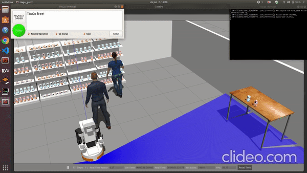

### Hello there 👋

### This is Max Polak!

- 🔭 Welcome to my Github page! 
- 🌱 I am currently a 2nd yearMSc student in Robotics at [TU Delft](https://www.tudelft.nl/en/). Prior to that, I obtained my Bachelor's degree in Mechanical Engineering at [TU Delft](https://www.tudelft.nl/en/) as well including a minor in Environmental Engineering.
- 😄 I am interested in using Deep Learning for robotics! 
- 📫 Feel free to contact me if you want to discuss interesting topics about robotics.

### Recent Projects
|TIAGo in Grocery Stores: Relocating Products Left at Checkout Back to Their Shelves | Ocean Cleanup Game Using Haptic Feedback Generated by the [Haply Device](https://2diy.haply.co/) |
|---|---|
 |  |

| Path Planning With Applications to Autonomously Guided Beds in a Hospital Environment Using GO-RRT | 3D Pedestrian Detection based on Sensor fusion (combining YOLO Object Detection + LiDAR + Radar + StereoVision) |
|---|---|
 |  |

<!--
**MaxPolak97/MaxPolak97** is a ✨ _special_ ✨ repository because its `README.md` (this file) appears on your GitHub profile.

Here are some ideas to get you started:

- 🔭 I’m currently working on ...
- 🌱 I’m currently learning ...
- 👯 I’m looking to collaborate on ...
- 🤔 I’m looking for help with ...
- 💬 Ask me about ...
- 📫 How to reach me: ...
- 😄 Pronouns: ...
- ⚡ Fun fact: ...
-->
